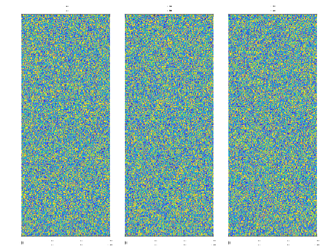
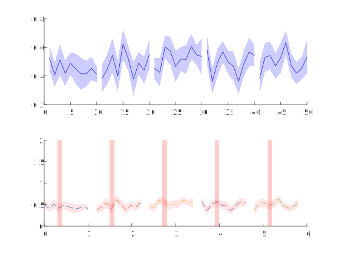

钙数据分析作图工具包，分为数据收集CollectData、数据转码Transcode和作图DrawFigure，3个子包。依赖[埃博拉酱的MATLAB工具包](https://github.com/Silver-Fang/EbolaChanMatlabToolbox)和[GuanLab杂项](https://github.com/ShanghaitechGuanjisongLab/Miscellany)
# 目录
[数据格式规范](#数据格式规范)
- [Rdc3格式](#Rdc3格式)
- [MECgRawsTags格式](#MECgRawsTags格式)
- [MECgBCalcium格式](#MECgBCalcium格式)

[CollectData](#CollectData)
- [MetaTags_METags](#MetaTags_METags)
- [Rdc3_Atr](#Rdc3_Atr)
- [Rdc3s_MECgBCalcium](#Rdc3s_MECgBCalcium)
- [RMs_MECgRaws](#RMs_MECgRaws)

[Transcode](#Transcode)
- [Atrs_TrialwiseTrace](#Atrs_TrialwiseTrace)
- [MEBCalcium_ElasticChart](#MEBCalcium_ElasticChart)
- [MECgRaws_OverallHeatmap](#MECgRaws_OverallHeatmap)
- [MECgSplitTrialsToExperimentsByTag](#MECgSplitTrialsToExperimentsByTag)
- [MECgSplitTrialsToExperimentsEqually](#MECgSplitTrialsToExperimentsEqually)
- [SortBeforeOH](#SortBeforeOH)

[DrawFigure](#DrawFigure)
- [ElasticChart](#ElasticChart)
- [OverallHeatmap](#OverallHeatmap)
- [TrialwiseTrace](#TrialwiseTrace)

[包外工具函数](#包外工具函数)
- [LMHColorMap](#LMHColorMap)
- [SplitOneSingleDimensionByAnother](#SplitOneSingleDimensionByAnother)
# 数据格式规范
本节描述了多个函数中用到的数据格式规范。
## Rdc3格式
本格式存储了一天内一只鼠一个细胞群体多个不同刺激Block的钙和标数据，包含处理前全长连续数据和经过ΔF/F₀处理、分Trial的数据。

fps(1,1)double，采样率

raw_tag(1,:,:)double，原始标。第2维是时间，第3维是Block

base_block(1,:)double，指示哪些Block无需拆分

nrd_c(:,:)cell，拆分、标准化后的数据。第1维是Block，第2维是细胞。元胞内是(:,:)double，第1维是Trial，第2维是时间

Name(:,1)cell，每个Block的名称。元胞内是(1,:)char。

TagCode(:,2)double，每个Block的编码，与Name对应。对应关系见[翻译表](+CollectData/TranslateTable.mat)

raw_data(:,:,:)double，原始数据。第1维是时间，第2维是细胞，第3维是Block
## MECgRawsTags格式
本格式存储了多天、多只鼠、多个不同实验、多个Trial、多个细胞群体的分Trial的细胞测量数据。以下字段在某些函数中并不全都需要。

Mice(:,1)string，参与实验的鼠名

Experiments(:,1)string，实验名

CellGroups(:,1)string，细胞群体名

MECgRaws(:,:,:)cell，钙信号测量值。第1维是实验，第2维是鼠，第3维是细胞类群。元胞里是(:,:,:)single，第1维是细胞，第2维是时间，第3维是Trial。

METags(:,:)cell，标通道逻辑值，表明某一时刻是否有标。第1维是不同实验，第2维是不同鼠。元胞内是(:,:)table，第1维是Trial，第2维是标通道。表格内是(:,1)logical，第1维是时间，通过一定阈值得到此刻是否有标的逻辑值。
## MECgBCalcium格式
本格式存储了多只鼠、多个实验条件、多个细胞群体、多个Block的细胞分Trial测量数据。以下字段在某些函数中并不全都需要。

Mice(:,1)string，参与实验的鼠名。

Experiments(:,1)string，实验名

CellGroups(:,1)string，细胞群体名

Blocks(:,1)string，模块名

MECgBCacium(:,:,:,:)cell，钙信号测量值。第1维是模块，第2维是细胞群，第3维是实验，第4维是鼠。元胞内是(:,:,:)double，第1维是Trial，第2维是时间，第3维是细胞。
# CollectData
该包负责将数据文件读入内存，整理成便于引用计算分析的格式。
## MetaTags_METags
将多个MetaTags文件读入为METags内存格式
### 输入参数
MTPaths(:,1)string，必需，MetaTags文件路径。

SizeT(1,1)uint16，必需，每个文件要截取的时间帧数，应当短于所有文件中的时间帧数，否则会出错。

TagThreshold(1,1)uint16=550，可选，将Tag值逻辑化时的阈值
### 返回值
返回[MECgRawsTags格式](#MECgRawsTags格式)规范中的Mice Experiments METags三个字段。
### MetaTags文件格式
MetaTags文件的标准文件名格式是：
```
<鼠名>.<日期时间>.<实验名>.<光电参数>.[_<Trial号>].MetaTags.mat
```
包含两个字段：

MetaData(1,1)struct
- ScannerType(1,1)string，扫描器类型，可以是"Resonant"或"Galvano"
- DeviceNames(:,1)string，采集设备名，如"RNDD4G"、"CD1"等。每行对应一个图像通道。
- Fps(1,1)double，采样帧率
- SizeX(1,1)double，图像宽度
- SizeY(1,1)double，图像高度
- SizeZ(1,1)double，图像深度
- SizeC(1,1)double，图像通道数
- SizeT(1,1)double，时间周期数
- DimensionOrder(1,1)string，维度顺序，通常是"XYCZT"
- OmeXml(1,1)string，OME元数据XML
- ChannelColors(:,4)table，包含Red, Green, Blue, Alpha四列，都是(1,1)uint8，每个通道一行，对应一个图像通道的颜色。

Tags(1,1)struct，每个字段是一个CD通道设备名，值是(:,1)double，每个元素为一帧的全像素平均值。
## Rdc3_Atr
将[Rdc3格式](#Rdc3格式)文件收集为Atr格式内存数据
### Atr格式
(:,:)cell，第1维对应TagCode第1列，第2维对应TagCode第2列。元胞内是(1,:)cell，第2维是细胞。元胞内是(:,:)double，第1维是Trial，第2维是时间。
### 输入参数
FilePath(1,1)string，Rdc2格式文件
### 返回值
atr(:,:)cell，Atr格式内存数据
## Rdc3s_MECgBCalcium
将一系列[Rdc3格式](#Rdc3格式)文件读入为MECgBCalcium内存格式
### 输入参数
Rdc3Paths(:,1)string，要读入的Rdc3文件路径

SelectedBlocks，如果是(:,1)string，每个元素必须是MECgBCalcium标准Block名；如果是(:,2)，每一行必须是MECgBCalcium标准TagCode。每个标准Block名对应一个TagCode(1,2)，TagCode作为行列坐标，对应块名记录在TranslateTable中。
### 返回值（MECgBCalcium格式）
Mice(:,1)string，鼠名

Experiments(:,1)string，实验名

CellGroups(:,1)string，细胞群名

Blocks(:,1)string，标准Block名。

Calcium(:,:,:,:)cell，ΔF/F₀处理后的钙信号测量值。第1维Block，第2维细胞群，第3维实验，第4维小鼠。元胞内(:,:,:)double，第1维Trial，第2维时间，第3维细胞。
## RMs_MECgRaws
将多个RM文件读入为MECgRaws内存格式
### 输入参数
RMPaths(:,1)string，RM文件路径

SizeT(1,1)uint16，每个文件要截取的时间帧数，应当短于所有文件中的时间帧数，否则会出错。
### 返回值
返回[MECgRawsTags格式](#MECgRawsTags格式)标准中的Mice Experiments CellGroups MECgRaws四个字段。
### RM文件格式
RM文件的标准文件名格式是：
```
<鼠名>.<日期时间>.<实验名>.<光电参数>._<Trial号>.Registered.<细胞类群>.Measurements.mat
```
其中只有一个字段Measurements(:,:)single，第1维是时间，第2维是细胞。
# Transcode
本包包含数据转码函数，将CollectData收集到的数据转化为适合于DrawFigure作图的格式。
## Atrs_TrialwiseTrace
将Atr格式数据转码为适合于TrialwiseTrace作图的格式
### Atr格式
(:,:)cell，第1维对应TagCode第1列，第2维对应TagCode第2列。元胞内是(1,:)cell，第2维是细胞。元胞内是(:,:)double，第1维是Trial，第2维是时间。
### 必需参数
Atrs(:,1)cell，每个元胞内是一个Atr数据单元

TagCodes(:,2)uint8{mustBePositive}，根据所需实验条件设置的Atr元胞索引

TimeIndices(1,:)uint16{mustBePositive}，要取出的时间索引（采样帧，不是真实时间）。例如1:500可取出前500帧。

### 名称-值对组参数
TrialsFromStart(1,:)uint8{mustBePositive}=[]，从开头计算，要取出哪些Trial。例如1:5取出前5个Trial

TrialsFromEnd(1,:)uint8{mustBePositive}=[]，从末尾倒数，要取出哪些Trial。例如5:-1:1取出后5个Trial，并正序排列；1:5同样取出后5个Trial，但倒序排列。

### 返回值（TrialwiseTrace作图数据）
MeanLines(:,:)double，第1维是不同的平均线，第2维是一条平均线上的不同时点数值。

ErrorShadows(:,:)double，第1维对应每条平均线的误差，第2维是一条平均线不同时点的误差
## MEBCalcium_ElasticChart
将[MECgBCalcium格式](#MECgBCalcium格式)数据准备成适合ElasticChart的格式

输入参数：MECgBCalcium格式中的MECgBCalcium Experiments Blocks字段。其中MECgBCalcium第2维必须单一，即只能有一个细胞群。

返回值：ElasticChart需要的DistanceMatrix和PointNames参数。
## MECgRaws_OverallHeatmap
准备MECgRaws格式数据，使其适合于DrawFigure.OverallHeatmap
### 必需参数
MECgRaws(:,:,:)cell，MECgRaws格式数据，详见自述文档

BaseLength(1,1)uint16，刺激前基线时间点数
### 重复参数
Flags(1,1)string，树立旗帜，是否启用以下特殊功能：
- DoLog，计算统计量之前先取对数
- PickMedian，不计算平均值，而是计算中位数
### 返回值
OHData(:,:,:)double，交付给DrawFigure.OverallHeatmap的数据
## MECgSplitTrialsToExperimentsByTag
按照指定的分类函数将MECgRaws的Trial分METags拆分到不同的实验

[MECgRawsTags格式](#MECgRawsTags格式)
### 输入参数
CgRaw(1,1,:)cell，MECgRaws源数据，Mouse和Experiment维度单一，可以有多个CellGroup。

TagTable tabular，METags元胞内的单个表格，与CgRaw的Mouse和Experiment对应

ClassifyFunction(1,1)function_handle，分标函数句柄。接受TagTable的某一行作为输入，输出分Experiment标识用于分组。
### 返回值
RawSplit(:,1,:)cell，Experiment维度拆分后的源数据

TagSplit(:,1)cell，Experiment维度拆分后的标数据
## MECgSplitTrialsToExperimentsEqually
将MECgRaws的Trial等量拆分到不同的实验

[MECgRawsTags格式](#MECgRawsTags格式)
### 输入参数
CgRaw(1,1,:)cell，MECgRaws源数据，Mouse和Experiment维度单一，可以有多个CellGroup。

TagTable tabular，METags元胞内的单个表格，与CgRaw的Mouse和Experiment对应

SplitNumber(1,1)uint8，拆分个数
### 返回值
RawSplit(:,1,:)cell，Experiment维度拆分后的源数据

TagSplit(:,1)cell，Experiment维度拆分后的标数据
## SortBeforeOH
在做总览热图OverallHeatmap之前对细胞进行分群排序。

将每个细胞按照它在哪天平均信号最强，归入那一群，然后将每一群聚拢排序以后展开在泳道上。

输入参数：Data(:,:,:)，第1维是泳道内不同的行，第2维是泳道内不同的列，第3维是不同的泳道

返回值：Data(:,:,:)，维度同输入，但经过了聚类和排序。
# DrawFigure
该包负责作图，只接受最接近直接作图的处理后数据，不负责数据处理
## ElasticChart
弹簧图，反映点之间的距离关系。

假设各点之间是弹簧，有一个自然长度，拉伸则变细但施加拉力，压缩则变粗但施加推力。已知各点之间的距离，连接上自然长度为这个距离的弹簧，就可以在二维平面上自动对抗平衡出弹簧系统图
### 必需参数
DistanceMatrix(:,:)numeric，正方形距离矩阵，两两点间距离的精确值。无数据的请填入NaN

PointNames(:,1)string，和矩阵边长相等的字符串向量，每个点的名称

Iteration(1,1)numeric，迭代次数。次数越多越精细准确，但耗时越长。
### 可选参数
Positions(1,:)complex，每个点的初始位置，行向量，用复数表示
### 名称-值对组参数
ScatterStyle(1,:)cell，散点样式，将传递给scatter，默认{[],'green'}

TextStyle(1,:)cell，文字样式，将传递给text，默认{'Color','red','HorizontalAlignment','center','VerticalAlignment','middle'}

PlotStyle(1,:)cell，线条样式，将传递给plot，默认{'blue'}
### 返回值
Positions(1,:)complex，弹簧系统平衡后的各点位置。
## OverallHeatmap
显示每个细胞不同天的全Trial平均Trace
```MATLAB
DrawFigure.OverallHeatmap(rand(300,300,3),"HideYAxis","ShowColorbar","ImagescStyle",{"XData",[0 3]},"SubTitles",["1" "2" "3"],"CBLabel","我是颜色棒");
```


因为生成的是随机数据，图线位置可能不同，但样式应当一致。
### 位置参数
Data(:,:,:)，必需，作图数据。第1维是不同的细胞，将作图为不同行；第2维是Trial内的时间轴，将作图到同一行；第3维是不同的天，将水平展开为不同的泳道
### 重复参数
Flags(1,1)string，可以重复设置以下旗帜：
- HideXAxis，隐藏X轴
- HideYAxis，隐藏Y轴
- ShowColorbar，显示颜色棒
### 名称-值对组参数
Colormap(:,3)double，可选，颜色映射。如不指定，将由MATLAB自动设置。

ImagescStyle(1,:)cell，本函数调用imagesc绘图，此处指定要传递给imagesc的其它参数。默认行为是，如果Data有正有负，则设为{[-AbsMax,AbsMax]}，其中AbsMax=max(abs(Data),[],"all")；否则为{}。建议至少设置XData和YData参数，保证XY坐标尺度正确。

SubTitles(1,:)string，每个泳道的小标题。如不指定，将不显示小标题。

CBLabel(1,1)string，颜色棒的标签。如不指定，将不显示标签。

TLStyle(1,:)cell={'TileSpacing','none','Padding','compact'}，本函数调用tiledlayout布局泳道，此处指定要传递给tiledlayout的其它参数。
### 返回值
Layout(1,1)matlab.graphics.layout.TiledChartLayout，使用tiledlayout生成的作图的布局。

ColorBar(1,1)matlab.graphics.illustration.ColorBar，如果制定了ShowColorBar旗帜，返回该颜色棒对象
## TrialwiseTrace
作单Trial追踪图，图上有多条相互断开的折线在X轴上排布，每条线可具有误差阴影和刺激范围
```MATLAB
tiledlayout("flow");
%% 基本用法
nexttile;
%生成一些随机数据
Data=rand(5,10,10);
%求平均值
Mean=mean(Data,3);
%求误差（此处使用SEM）
Error=std(Data,0,3)/sqrt(10);
%作图
[Lines,Shadows]=DrawFigure.TrialwiseTrace(Mean,Error);
%% 自定义样式
nexttile;
%横轴在0~1之间
Xs=linspace(0,1,10);
%阴影区为半透明红色
FillStyle={"r","FaceAlpha",0.1,"LineStyle","none"};
%图线为虚线
PlotStyle={"--"};
%绘制刺激范围
StimuRange=[0.3 0.4];
%Y轴范围
YLimit=[0 2];
%每条线间隔X为0.1
XSpacing=0.2;
[Lines,Shadows,Stimuli]=DrawFigure.TrialwiseTrace(Mean,Error,XSpacing,"StimuRange",StimuRange,"ShadowStyle",FillStyle,"LineStyle",PlotStyle,"Xs",Xs,"YLimit",YLimit);
```


因为生成的是随机数据，图线位置可能不同，但样式应当一致。
### 必需参数
MeanLines(:,:)，每一行是一条平均线上的不同时点数值，不同行是不同的平均线

ErrorShadows(:,:)，每一行是一条平均线不同时点的误差，不同行是不同线的误差
### 可选参数
XSpacing(1,1){mustBeNonnegative}=1，每条线之间的X距离
### 名称-值对组参数
StimuRange(1,2)，刺激所在的时间范围。如不指定，则不绘制刺激范围，不输出返回值Stimuli。

Xs(1,:)=1:width(MeanLines)，各时点的X值

YLimit(1,2)，Y轴数值范围。如不指定，则由MATLAB自动设置。

LineStyle(1,:)cell={'b'}，均值折线的样式，将传递给plot函数实现

ShadowStyle(1,:)cell={"b","FaceAlpha",0.2,"LineStyle","none"}，误差阴影的样式，将传递给fill函数实现

StimuStyle(1,:)cell={"r","FaceAlpha",0.2,"LineStyle","none"}，刺激范围的样式，将传递给fill函数实现。如果StimuRange未指定，将忽略该参数。
### 参数互限
MeanLines和ErrorShadows应当具有完全相同的尺寸，且与Xs具有相同的宽度
### 返回值
Lines(:,1)matlab.graphics.chart.primitive.Line，平均线，plot函数返回的图线对象

Shadows(:,1)matlab.graphics.primitive.Patch，误差阴影，fill函数返回的填充对象

Stimuli(:,1)matlab.graphics.primitive.Patch，刺激范围，fill函数返回的填充对象。如果StimuRange未指定，将不返回该参数，尝试取得该返回值将导致错误。
# 包外工具函数
## LMHColorMap
生成低、中、高三阶段分布的Colormap
### 必需位置参数
Lowest(1,3)double，最小值的RGB颜色，应在[0,1]之间

Middle(1,3)double，中间值的RGB颜色，应在[0,1]之间

Highest(1,3)double，最大值的RGB颜色，应在[0,1]之间
### 可选位置参数
LowSteps(1,1)uint8=255，低段区分色阶数

HighSteps(1,1)uint8=255，高段区分色阶数
### 返回值
Colormap(:,3)double，生成的颜色映射图
## SplitOneSingleDimensionByAnother
将数组某一维度的数据按照分组标记拆分到另一个单一维度中，使得那个单一维度扩张，多出来的空位用指定值补全。

如下代码，先生成4×4×4的随机数，然后将第1维度按照[1 1 2 3]拆分到第4维度中去，多出来的空位用NaN补全。
```MATLAB
[SplitArray,UniqueMarkers] = SplitOneSingleDimensionByAnother(rand(4,4,4),4,1,[1 1 2 3],NaN);
```
拆分后的数组SplitArray是4×4×4×3，(:,:,:,1)存放原数组(1:2,:,:)的数据，(:,:,:,2)存放原数组(3,:,:)的数据，(:,:,:,3)存放原数组(4,:,:)的数据。UniqueMarkers标识扩张维度上每一维存放了对应了哪个分组标记的那些维度的数据。
### 输入参数
Array，多维数组

SingleDimension(1,1)uint8，要扩张的单一维度

GroupDimension(1,1)uint8，要拆分的维度

GroupMarkers(:,1)，分组标记向量，其长度必须等于Array的GroupDimension维度的长度

EmptyValue(1,1)，填补空位的标量值
### 返回值
SplitArray，拆分-扩张后的数组结果

UniqueMarkers(:,1)，向量长度与SplitArray第SingleDimension维度相等，标识扩张维度上每一维存放了对应了哪个分组标记的那些维度的数据。